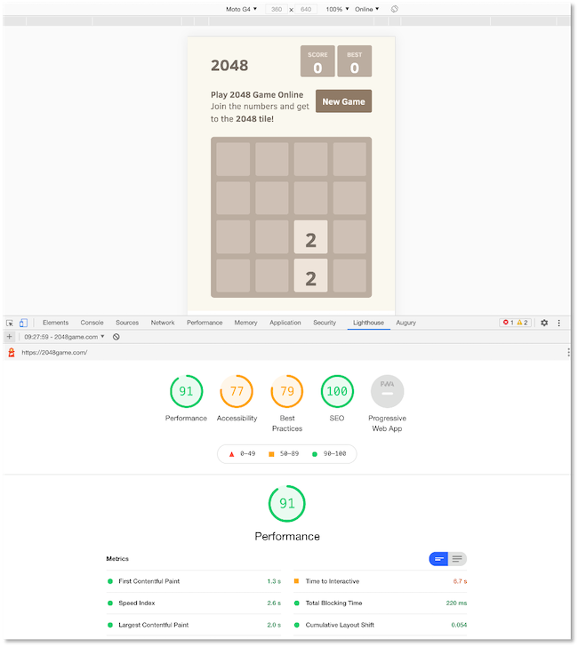

# Einführung

In diesem Semester geht es um **Progressive Web Apps (PWA)**. PWA sind Funktionen, die wir Webanwendungen hinzufügen können, um sie in ihrer Funktionalität zu erweitern. Die so werweiterten Webanwendungen kommen mit solchen Funktionen nativen Apps immer näher, d.h. das *Look and Feel* gleicht sich mit PWAs nativen Apps an. Dazu gehören Funktionalitäten, wie z.B. 

- die Möglichkeit, die Webanwendung auch offline zu verwenden,
- die Kamera zu nutzen, 
- den eigenen Standort zu verwenden, 
- Daten im Hintergrund zu synchronisieren. 

Das bedeutet aber nicht automatisch, dass wir ausschließlich auf moderne Browser angewiesen sind, die diese Funktionalitäten von PWAs unterstützen. Die Webanwendungen sollen auch weiterhin auf alten Webbrowsern laufen, dann jedoch eventuell ohne einige oder alle PWA-Funktionalitäten. 

Progressive Web Apps müssen 

- **zuverlässig** (*reliable*) sein, d.h. sie müssen schnelle Ladezeiten aufweisen und sogar (teilweise) offline funktionieren, 
- **schnell** sein, d.h. schnell auf Nutzerinteraktionen reagieren, 
- **motivierend** sein, die Webanwendung zu verwenden, d.h. einerseits intuitiv bedienbar und anderseits, z.B. über Push-Notifikationen, die Nutzerinnen animieren, die App zu nutzen.

Die prinzipielle Idee einer Progressive Web App lässt sich vereinfacht durch die folgenden Abbildung veranschaulichen:

Eine Progressive Web App ist eine Webanwendung, die sich wie eine native mobile App verhält. 

## Webanwendungen vs. native Apps

Die meisten Nutzerinnen verwenden die meiste Zeit native Apps auf ihrem Smartphone. Nur zu einem geringen Prozentsatz werden Web-Anwendungen (also der Browser) auf dem Smartphone verwendet. Das spricht eigentlich eher dafür, dass wir uns mit der Entwicklung nativer Apps beschäftigen sollten, als mit der Entwicklung von (mobilen) Webanwendungen. Die vorrangige Verwendung nativer Apps hat mehrere Gründe:

- **Push-Notifikationen**: Native Apps laufen im Hintergrund und die Nutzerinnen werden über Push-Notifikationen informiert, wenn etwas Neues passiert ist, z.B. neue Nachrichten , E-Mails, etc. Man muss also gar nicht aktiv die native App bedienen, um über Aktuelles informiert zu werden. 
- **App-Icons auf dem Home-Bildschirm**: ermöglichen einen schnellen, direkten Zugang zu den Apps. 
- **Gerätefunktionen**: wie z.B. Standortermittlung, Kameras und Mikrofine können leicht in native Apps eingebaut werden. Für Webanwendungen ist dies nur aufwändig möglich. 
- **Offline-Funktionalitäten**: viele native Apps können auch offline ganz oder teilweise verwendet werden, z.B. Spiele oder Musikapps, die heruntergeladene Musik abspielen. 

App-Icons auf dem Home-Bildschirm können wir auch für Links auf unsere Webanwendung erstellen und die anderen drei Argumente wollen wir ja genau mit Progressive Web Apps zunichte machen. Das heißt, mit Progressive Web Apps kommen die Vorteile nativer Apps im Vergleich zu Webanwendungen nicht mehr zum Tragen. 

Demgegenüber stahen zwei Gründe, warum Webanwendungen besser sind als native Apps:

- Native Apps müssen sowohl für iOS als auch für Android erstellt werden, um eine möglichst große Nutzerinnenzahl anzusprechen. Dazu müssen auch unterschiedliche programmiersprachen verwendet werden (Swift für iOS und Java/Kotlin für Android). Zwar versuchen Hybride Tools diesen Nachteil zu umgehen, aber es gelingt nicht wirklich. 
- Es werden so gut wie nie neue native Apps auf Smartphones geladen. Umfragen ergeben, dass Nutzerinnen die allermeiste Zeit am Smartphone mit höchstens drei Apps verbringen. Alle weiteren Apps werden am Anfang der Nutzung installiert. Es kommen im Laufe eines "Smartphone-Lebens" kaum welche hinzu. Die durchschnittliche Anzahl neuhinzugefügter Apps im Monat liegt bei nahe 0. 

Die Verwendung von Webanwendungen ist deutlich einfacher. Man muss nichts installieren. Man googlet einfach und öffnet dann die Seite. Die Bandbreite aller Webanwendungen ist deutlich schneller erreichbar als eine große Anzahl an nativen Apps. Die Reichweite einer Webanwendung ist deutlich größer als die Reichweite einer nativen App. 

| | Funktionalitäten | Nutzerinnen-Reichweite |
|----------|---------------|------------------|
|native App |Zugriff auf Gerätefunktionalitäten |nur sehr wenige Apps werden von sehr vielen Nutzerinnen die meiste Zeit verwendet |
|herkömmliche Webanwendungen |sehr eingeschränkter (gar kein) Zugriff auf Gerätefunktionalitäten |hohe Reichweite, sehr einfacher Zugang | 
|progressive Webanwendungen |Zugriff auf Gerätefunktionalitäten |hohe Reichweite, sehr einfacher Zugang | 

## Links und Videos

Hier zwei kurze Einführungsvideos zu PWAs:

- [Progressive Web Apps in 100 Seconds](https://www.youtube.com/watch?v=sFsRylCQblw)
- [Progressive Web Apps - PWA Roadshow](https://www.youtube.com/watch?v=z2JgN6Ae-Bo)

Hier einige intressante Links zu PWAs:

- [Learn PWA](https://web.dev/learn/pwa/)
- [Progressive Web-Apps: Was versprechen die progressiven Apps?](https://www.ionos.de/digitalguide/websites/web-entwicklung/progressive-web-apps-welche-vorteile-bieten-sie/)
- [Online Verzeichnis PWAs](https://pwa.bar/)

## PWAs vs. SPAs

Wir haben noch immer nicht unsere erste Progressive Web App erstellt ;-(. Bevor wir das tun, diskutieren wie zunächst noch die Unterschiede zwischen einer *Progressive Web App* und einer *Single Page Application*, wie wir sie im WebTech-Kurs erstellt haben. 

*Single Page Applications (SPAs)* sind Webanwendungen, die mit JavaScript erstellt werden, typischerweise mit einem JavaScript-Framewaork, wie [Angular](https://angular.io/), [React](https://reactjs.org/) oder [Vue.js](https://vuejs.org/). In SPAs wird das DOM ständig neu gerendert, welches sich durch Nutzereingaben oder Lifecycle-Events ändert. Das Grundgerüst einer SPA besteht aus genau einer `HTML`-Seite (typischerweise `index.html`), in die verschiedene Komponenten eingebunden wird. Eine Single Page Application ist vornehmlich hoch *reaktiv* auf Nutzereingaben, im Sinne von schneller Reaktion. 

*Progressive Web Applications (PWAs)* sind eine Sammlung verschiedener Technologien. Es ist völlig egal, ob diese Technologien in eine Single Page Application eingebunden werden oder in eine "herkömmliche" (Multi-Page-) Webanwendung. Die Idee einer PWA ist, dass sie hoch *reaktiv* im Sinne ständiger Verfügbarkeit ist. JavaScript spielt bei PWAs nicht die dominate Rolle, wie bei SPAs. Sie können eine oder mehrere *progressive* Funktionalitäten existierender Webanwendungen hinzufügen (service worker, caching, push notifivcations, ...) oder eine PWA von Grund auf neu implementieren. 

## Lighthouse

[Lighthouse](../tools/#lighthouse) ist ein Plugin für die Developertools von Chrome, mit dessen Hilfe gemessen werden kann, wie *progressive* eine Webanwendung ist. Die folgende Abbildung zeigt den Einsatz von Lighthouse für die PWA [https://2048game.com/](https://2048game.com/) - ein Spiel, das Sie wahrscheinlich kennen. 

Wechseln Sie in den Developertools auf die mobile Ansicht. Wählen Sie dann im Reiter `Lighthouse` die Analyse. Probieren Sie auch mal aus, die Anwendung im Offline-Modus zu verwenden. Wechseln Sie dazu in den Developertools auf den Reiter `Network` und dort in der Auswahlliste auf `Offline`. Selbst wenn Sie `Disable Cache` anklicken, werden Sie feststellen, dass sich das Spiel noch spielen lässt. Viel Spaß! ;-)

## PWA Checklist

Im Lighthouse-Plugin finden Sie auch einen Link zur **PWA Checklist**. Diese Checklist wird verwendet, um zu beurteilen, wie *progressive* eine Webanwendung ist. Eine gute Übersicht finden Sie auch [hier](https://web.dev/pwa-checklist/).

!!! success
	Wir haben jetzt eine Idee davon, was *Progressive Web Apps* sind. Jetzt legen wir los und erstellen eigene PWAs!